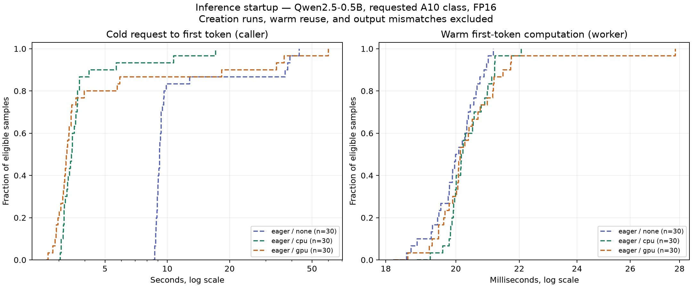

# 2026-10-06 — What does compilation change about snapshot value?

**Status: repeated eager measurements and compiled smoke validation complete; repeated compiled cohort remains the next experiment.**

## Hypothesis

GPU snapshots become more useful when they preserve expensive compiled runtime state. For an eager model, restore cost may instead compete with relatively cheap GPU initialization. The first smoke samples are insufficient to establish either effect.

## Method

Reproduce the eager baseline with 30 verified cold samples per mode, then test a compiled variant under the same controls. Qwen2.5-0.5B-Instruct, pinned model revision, requested A10 GPU class, FP16, eager attention, fixed prompt, and two forward passes are held constant. Compiled execution uses `torch.compile(mode="default", dynamic=False)` and one compiler thread. Explicit CUDA graph capture is outside this experiment.

Worker retirement is checked before timing, then verified again with boot identity and request index. Match boot logs to platform snapshot events. Creation-inclusive requests, warm reuse, missing restore evidence, and incorrect output do not count toward the cold-restore cohort. An immediate same-worker request measures warm first-token computation.

Compilation wrapper setup, the first forward, and the second forward have separate timers. GPU snapshots capture this work; CPU snapshots run GPU setup and compilation after restore. Capture-time stage values are never added to restoration latency. [Full protocol and collection scripts](../experiments/2026-10-06-compiled-startup/README.md).

The collector makes serial requests and randomizes configuration order within each round. Eager and compiled cohorts are collected in separate phases; host placement and cache state are uncontrolled. Treat comparisons as descriptive, with sample counts and distributions rather than a significance claim.

Environment records reveal heterogeneous placement: NVIDIA A10/driver 580.95.05 and NVIDIA A10G/driver 610.57.04. Report GPU/driver groups separately as well as pooled results. This is an additional limitation on attributing differences solely to the execution configuration.

## Numbers

Eager cohort: 95 attempts, 90 eligible cold samples, zero errors, zero output mismatches, and zero warm-worker reuse. CPU mode excludes two creation runs and one request without sufficient restore evidence; GPU mode excludes two creation runs. Offline review adds capture-lineage verification; it changes zero classifications. Both original and reviewed evidence are retained.

| Eager startup path | Eligible / attempted | Median (ms) | Interquartile range (ms) | Min–max (ms) |
| --- | ---: | ---: | ---: | ---: |
| Ordinary | 30 / 30 | 9,180.70 | 8,938.39–9,599.97 | 8,699.17–43,472.40 |
| CPU restore | 30 / 33 | 3,453.48 | 3,185.97–3,685.27 | 3,042.65–17,128.90 |
| GPU restore | 30 / 32 | 3,262.36 | 3,064.04–3,614.81 | 2,652.59–60,059.13 |

Warm worker first-token computation medians are 20.04, 20.19, and 20.14 ms respectively, with 30 matching-worker probes each. P95 is omitted because each cohort has fewer than 100 eligible samples.

Ordinary startup stage medians: imports 2,780.37 ms; tokenizer 365.99 ms; CPU weight loading 1,949.24 ms; CUDA initialization 196.97 ms; GPU transfer 120.98 ms; first forward 252.31 ms; second forward 18.73 ms. These are separate marginal medians, not an additive decomposition of the median request. The per-request residual outside instrumented stages has median 3,441.58 ms and maximum 38,008.39 ms.

All ordinary and CPU-restore samples use A10/driver 580.95.05. GPU restore has 29 samples on that pair (median 3,254.04 ms) and one on A10G/driver 610.57.04 (3,966.64 ms). One sample cannot establish an environment-specific distribution.

[Raw requests, platform logs, verification mappings, manifests, and source archives](../experiments/2026-10-06-compiled-startup/results/eager/); [machine-readable summary](../experiments/2026-10-06-compiled-startup/results/eager-summary.json). The source archive matches the manifest at collection start; the reviewed evidence uses the current classifier's additional lineage check.

### Compiled smoke validation

Five attempts produce one eligible sample per configuration, excluding one CPU and one GPU snapshot creation. All five return token ID 576; there are no errors or warm-worker reuses. This validates compatibility for the tested prompt; it does not establish distributions or full-model numerical equivalence.

| Compiled path | Eligible samples | Caller TTFT (ms) | Warm worker computation (ms) | GPU / driver |
| --- | ---: | ---: | ---: | --- |
| Ordinary | 1 | 93,090.93 | 12.39 | A10G / 610.57.04 |
| CPU restore | 1 | 44,391.49 | 8.94 | A10 / 580.95.05 |
| GPU restore | 1 | 5,789.58 | 8.48 | A10 / 580.95.05 |

The CPU restore spends 38,678.90 ms in its first forward after restore. The GPU snapshot creation spends 38,840.37 ms in that forward before capture; the subsequent GPU restore returns the expected token without repeating that initialization hook. Its first request still spends 139.70 ms inside the worker, versus 8.48 ms on the immediate warm probe, so preserving initialization does not eliminate all first-request work.

Creation-inclusive caller times are 66,119.85 ms for CPU and 69,123.73 ms for GPU. The ordinary compiled first forward takes 76,441.28 ms on a different GPU/driver pair. Hardware placement and the single sample per mode prevent a fair speedup estimate.

[Compiled raw data and source archive](../experiments/2026-10-06-compiled-startup/results/compiled-smoke/); [compiled summary](../experiments/2026-10-06-compiled-startup/results/compiled-smoke-summary.json). Platform log collection includes earlier eager events from the same application; eligibility is restricted to this cohort's request identities.

## Conclusion

Snapshot restores have lower median caller TTFT in this eager cohort. GPU restore's median is 191.13 ms below CPU restore's, while its maximum reaches 60,059.13 ms. These observations support testing compilation, but do not establish reliable tail latency or a causal platform-independent speedup.

Imports are the largest instrumented ordinary-startup stage, with a 2,780.37 ms median. Substantial time remains outside instrumentation. An ordinary startup took 38,195.15 ms while its instrumented initialization stages totaled 5,749.63 ms. The remaining time includes uninstrumented work and platform/RPC effects; it cannot be labeled as one startup stage. Caller TTFT must remain separate from worker stage timings.

Compiled smoke validation supports the mechanism: CPU snapshots leave expensive first-forward work after restore, while the tested GPU snapshot retains the initialized compiled path. The 5,789.58 ms GPU restore is a successful compatibility result, not a benchmark distribution. Repeated compiled measurements are still needed.

## Next question

Does the compiled result hold over 30 verified starts per mode, with GPU/driver groups reported separately? In particular, how much first-request work remains after restoring compiled state, and how variable is the caller latency?
